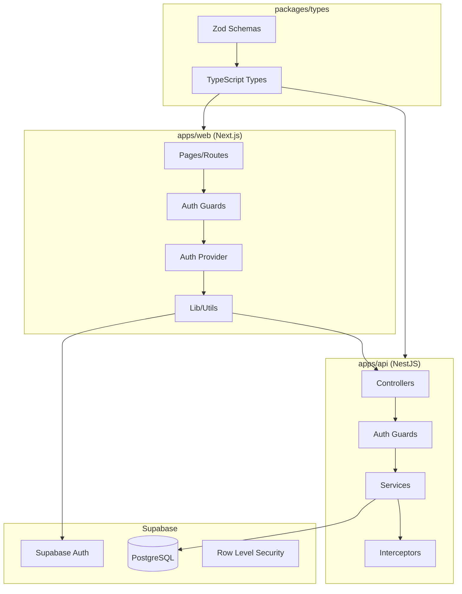
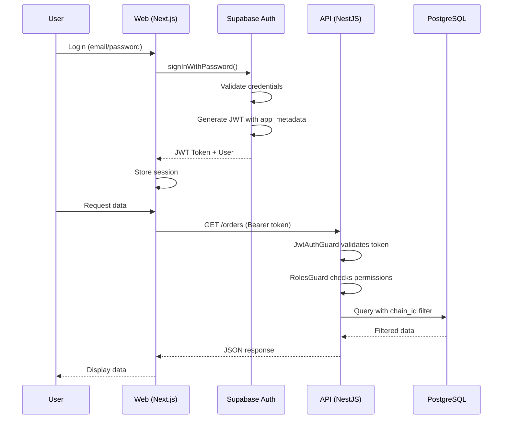
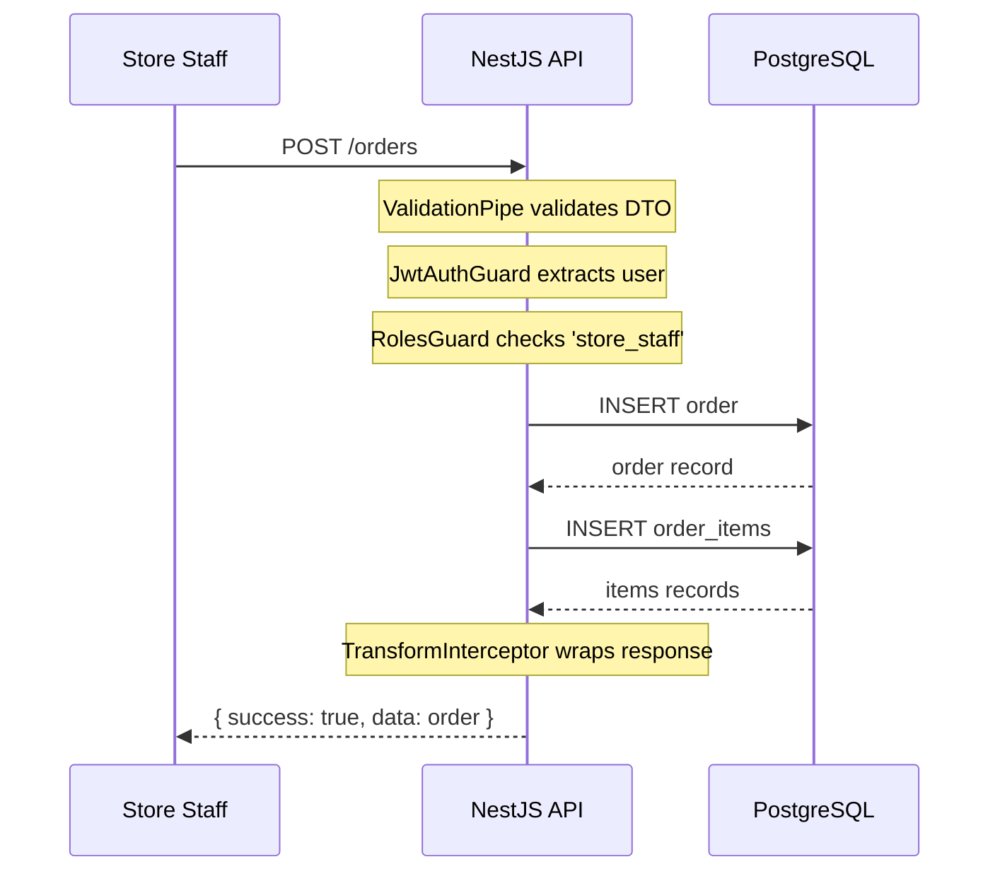
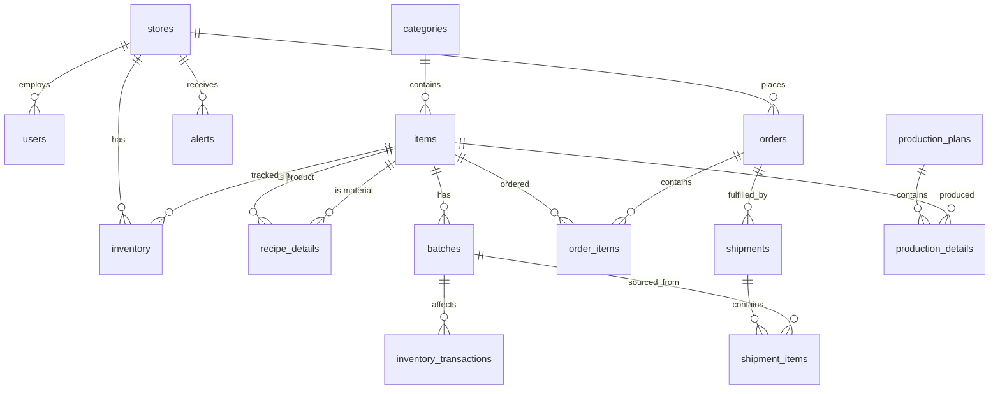

# CKMS - System Architecture

## High-Level Overview

```
┌─────────────────────────────────────────────────────────────────┐
│                         CKMS System                              │
├─────────────────────────────────────────────────────────────────┤
│                                                                  │
│  ┌─────────────┐         ┌─────────────┐         ┌───────────┐  │
│  │   Next.js   │  HTTP   │   NestJS    │  SQL    │ Supabase  │  │
│  │   Frontend  │◄───────►│   Backend   │◄───────►│ PostgreSQL│  │
│  │  (port 3000)│         │  (port 3001)│         │           │  │
│  └─────────────┘         └─────────────┘         └───────────┘  │
│        │                       │                       │        │
│        │                       │                       │        │
│        ▼                       ▼                       ▼        │
│  ┌─────────────┐         ┌─────────────┐         ┌───────────┐  │
│  │  Supabase   │         │   Swagger   │         │    RLS    │  │
│  │    Auth     │         │    Docs     │         │  Policies │  │
│  │   (JWT)     │         │ (/api/docs) │         │           │  │
│  └─────────────┘         └─────────────┘         └───────────┘  │
│                                                                  │
└─────────────────────────────────────────────────────────────────┘
```

## Component Architecture



## Authentication Flow



## Data Flow

### Order Creation Flow



## Database Schema



## Security Architecture

### Authentication Layers

| Layer | Component | Responsibility |
|-------|-----------|----------------|
| 1 | Supabase Auth | User authentication, JWT generation |
| 2 | JwtAuthGuard | Token validation, user extraction |
| 3 | RolesGuard | Role-based access control |
| 4 | RLS Policies | Database-level row security |

### JWT Payload Structure

```json
{
  "sub": "user-uuid",
  "email": "user@example.com",
  "app_metadata": {
    "chain_id": 1,
    "role": "store_staff",
    "store_id": 5
  },
  "aud": "authenticated",
  "exp": 1234567890
}
```

### Data Isolation

- All queries filter by `chain_id` from JWT
- Backend uses service role key (bypasses RLS)
- Frontend uses anon key (RLS enforced)
- Never trust client-provided identifiers

## Deployment Architecture

### Development
```
Local Machine
├── Supabase (Docker via supabase start)
│   ├── PostgreSQL :54322
│   ├── Auth :54321
│   └── Studio :54323
├── API (bun run dev) :3001
└── Web (bun run dev) :3000
```

### Production (Planned)
```
Cloud Provider
├── Supabase Cloud
│   ├── PostgreSQL (managed)
│   └── Auth (managed)
├── API (container/serverless)
└── Web (Vercel/static)
```

## Monorepo Structure

```
Turborepo Pipeline
├── build: apps/api, apps/web, packages/types
├── dev: parallel development servers
├── lint: ESLint across all packages
└── clean: remove build artifacts
```

### Package Dependencies
```
apps/api
└── @ckms/types (workspace:*)

apps/web
└── @ckms/types (workspace:*)

packages/types
└── zod (external)
```
